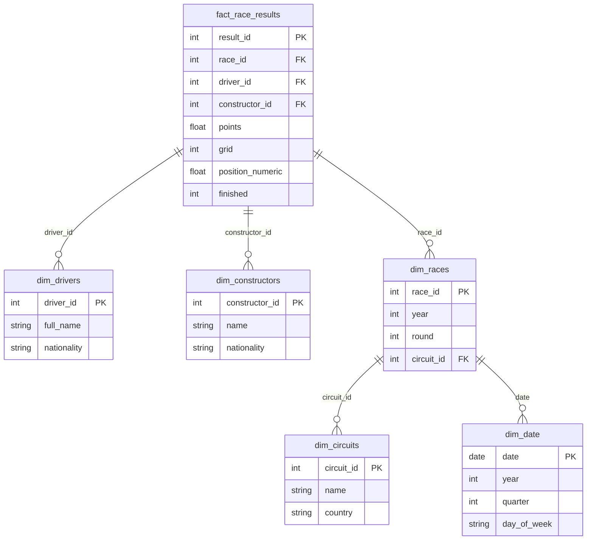

# Formula 1 Performance Analysis
### End-to-End Data Engineering Pipeline · Modern Era 2000–2024

> A production-grade data engineering project: 14 raw source tables, a modular Python pipeline, DuckDB star-schema warehouse, dbt transformation layer, Parquet output with PyArrow partitioning, and 7 analytical charts with data-driven insights.

[](https://github.com/AugustoTonelli14/f1-data-pipeline/actions)
[](https://python.org)
[](https://pandas.pydata.org)
[](https://duckdb.org)
[](LICENSE)

---

## Overview

This project transforms raw Formula 1 historical data into structured, analysis-ready datasets and uses them to answer seven concrete analytical questions about driver performance, team dominance, championship competitiveness, and engineering reliability across 25 seasons (2000-2024).

It is built as a **complete data engineering workflow** with modular source code, schema validation, structured logging, a DuckDB dimensional model, dbt-based SQL transformations, and Parquet output with PyArrow partitioning.

---

## Architecture

```
14 raw CSV files (Ergast flat-file export)
      |
      v
  INGESTION          Schema validation, null replacement, era filter (2000-2024)
      |
      v
  CLEANING           Type casting, column standardisation, deduplication
      |
      v
  TRANSFORMATION     Feature engineering, HHI computation, mart construction
      |                                     |
      v                                     v
  4 ANALYTICAL MARTS (Parquet)       DuckDB STAR SCHEMA
  |-- driver_performance_mart        |-- fact_race_results
  |-- team_performance_mart          |-- dim_drivers
  |-- season_trends_mart             |-- dim_constructors
  +-- fact_race_results (partitioned)|-- dim_circuits
      |                              |-- dim_races
      v                              +-- dim_date
  dbt LAYER (dbt-duckdb)
  |-- 7 staging models (views)
  +-- 4 mart models (tables)
      |
      v
  ANALYSIS           7 charts, narrative insights, executive summary
```

**Pipeline runtime: ~3.5 seconds on the full dataset.**

---

## Business & Analytical Objective

| Question | Approach |
|---|---|
| Who are the greatest drivers of the modern era? | Career-level aggregated performance metrics |
| What separates elite drivers from very good ones? | Win rate vs podium rate multidimensional analysis |
| Was F1 competition as fierce as it felt? | Herfindahl-Hirschman Index (HHI) applied to win share |
| Which constructors dominated, and when did power shift? | Season-by-season time-series analysis |
| Does finishing races matter as much as going fast? | DNF rate vs points-per-race trade-off analysis |
| How close were the real title fights? | Margin-of-victory decomposition across 25 seasons |
| Which teams built the most reliable cars? | Cross-season reliability heatmap (2015-2024) |

---

## Dataset

**Source:** [Ergast Motor Racing API](http://ergast.com/mrd/) - flat-file historical export.

| Table | Rows | Role |
|---|---|---|
| `results` | 26,759 | Core race outcomes |
| `lap_times` | 589,081 | Per-lap performance |
| `driver_standings` | 34,863 | Cumulative WDC standings |
| `constructor_standings` | 13,391 | Cumulative WCC standings |
| `pit_stops` | 11,371 | Stop timing and duration |
| `qualifying` | 10,494 | Q1/Q2/Q3 lap times |
| `races` | 1,125 | Race metadata |
| `drivers` | 861 | Driver profiles |
| `constructors` | 212 | Team profiles |
| `circuits` | 77 | Track metadata |

**Key data quality challenges:** non-standard null encoding (`\N`), mixed-type position column (integers + status codes), lap time strings requiring millisecond parsing, calendar size drift (16 to 24 races/season).

---

## Dimensional Model

The pipeline builds a star schema in DuckDB for OLAP-style queries:



**Design decisions:** Type 1 SCD for all dimensions. Fact grain is one row per driver per race entry. Date dimension generated from race dates (sparse calendar). Stored as a single DuckDB file (`outputs/f1_warehouse.duckdb`).

---

## dbt Layer

The project includes a dbt layer (`dbt/`) using `dbt-duckdb` for SQL-native transformations:

**Staging models** (7 views): `stg_results`, `stg_drivers`, `stg_constructors`, `stg_races`, `stg_circuits`, `stg_qualifying`, `stg_pit_stops`

**Mart models** (4 tables): `mart_driver_performance`, `mart_team_performance`, `mart_season_overview`, `mart_circuit_stats`

All staging models include schema tests (`unique`, `not_null`) defined in `schema.yml`.

---

## Data Formats

| Output | Format | Details |
|---|---|---|
| Analytical marts | Parquet | Single-file, PyArrow engine |
| `fact_race_results` | Partitioned Parquet | Partitioned by `year` for query pruning |
| DuckDB warehouse | `.duckdb` | Star schema with 6 tables |
| dbt output | DuckDB | Separate database at `outputs/f1_dbt.duckdb` |
| Charts | PNG | 7 F1-themed visualisations at 150 DPI |

The pipeline defaults to Parquet output. CSV fallback is available via `CONFIG["output_format"] = "csv"` in `src/pipeline.py`.

---

## Key Insights

1. **Hamilton leads by volume; Verstappen leads by rate.** Hamilton accumulated the most career points and wins in the modern era, but Verstappen's per-race efficiency is marginally higher across a shorter career span.

2. **2023 was the most statistically dominant season in modern F1 history.** The HHI index reached its highest point, exceeding even the peak Schumacher-era dominance by a significant margin.

3. **Real title fights are rare.** Only 8 of 25 seasons were decided by fewer than 20 points, with four decided by 4 points or fewer.

4. **Reliability and speed are not a trade-off.** Elite teams optimise both simultaneously. Reliability failures in competitive years represent quantifiable opportunity cost in championship points.

5. **The calendar grew 50% since 2003.** Raw career totals systematically favour modern-era drivers. Per-race normalisation is analytically mandatory for cross-era comparisons.

6. **2012 was the most competitive season in modern F1.** Seven different winners in seven races; championship decided on the final lap of the final race.

---

## Skills Demonstrated

| Skill | Implementation |
|---|---|
| **ETL pipeline design** | 3-stage pipeline with structured logging, error handling, and idempotent stages |
| **Schema validation** | Column-level checks against expected schemas for 14 source tables |
| **Data cleaning** | camelCase-to-snake_case conversion, type casting, deduplication, null handling |
| **Feature engineering** | Derived metrics (win rate, HHI, positions gained), multi-table joins |
| **Dimensional modeling** | DuckDB star schema with fact + 5 dimension tables |
| **SQL transformations** | dbt models with staging/mart pattern and schema tests |
| **Columnar storage** | Parquet output with PyArrow partitioning by season |
| **Data visualisation** | 7 Matplotlib charts with custom F1 theming |
| **Testing** | 47 pytest unit tests covering helpers, cleaners, and mart builders |
| **CI/CD** | GitHub Actions with ruff lint, pytest, and pipeline smoke test |
| **Code quality** | ruff linter, pyproject.toml config, Makefile automation |

---

## How to Run

### 1. Clone and install
```bash
git clone https://github.com/AugustoTonelli14/f1-data-pipeline.git
cd f1-data-pipeline
pip install -r requirements.txt
```

### 2. Add raw data
Download the [Ergast CSV flat files](http://ergast.com/mrd/) and place all 14 CSVs in `data/raw/`.

### 3. Run the pipeline
```bash
python src/pipeline.py
```
Produces four Parquet marts in `outputs/` and a timestamped log in `logs/`.

### 4. Build the DuckDB warehouse
```bash
python src/modeling.py
```
Creates the star schema at `outputs/f1_warehouse.duckdb`.

### 5. Run dbt models (optional)
```bash
cd dbt
dbt run --vars '{"processed_dir": "../data/processed"}' --profiles-dir .
dbt test --profiles-dir .
```

### 6. Generate charts
```bash
python src/analysis.py
```
Saves 7 PNG charts to `outputs/charts/`.

### 7. Open the notebook
```bash
jupyter notebook notebooks/F1_Analysis.ipynb
```

### Makefile shortcuts
```bash
make all        # pipeline + warehouse + dbt + analysis
make test       # run pytest suite
make lint       # run ruff linter
```

---

## Project Structure

```
f1-data-pipeline/
├── README.md
├── pyproject.toml                  # Ruff, pytest, project config
├── requirements.txt
├── Makefile                        # Build automation targets
├── LICENSE
├── .github/workflows/ci.yml       # CI: lint + test + smoke
├── architecture/
│   └── star_schema.md             # Mermaid ERD + design notes
├── data/
│   ├── raw/                       # Ergast CSV source files
│   │   └── era_snapshot/          # Era-filtered audit trail
│   └── processed/                 # Cleaned tables (*_clean.csv)
├── dbt/
│   ├── dbt_project.yml
│   ├── profiles.yml
│   └── models/
│       ├── staging/               # 7 staging views + schema.yml
│       └── marts/                 # 4 mart tables + schema.yml
├── src/
│   ├── __init__.py
│   ├── ingestion.py               # Stage 1: load, validate, filter
│   ├── cleaning.py                # Stage 2: clean, standardise, cast
│   ├── transformation.py          # Stage 3: feature engineering, marts
│   ├── modeling.py                # DuckDB star schema builder
│   ├── analysis.py                # Chart generation (7 charts)
│   └── pipeline.py                # Main orchestrator
├── tests/
│   ├── test_ingestion.py          # 11 tests
│   ├── test_cleaning.py           # 25 tests
│   └── test_transformation.py     # 11 tests
├── notebooks/
│   └── F1_Analysis.ipynb          # Interactive analysis notebook
├── outputs/
│   ├── *.parquet                  # Mart outputs
│   ├── fact_race_results/         # Partitioned by year
│   ├── f1_warehouse.duckdb        # Star schema database
│   └── charts/                    # Generated PNG charts
└── logs/                          # Timestamped pipeline logs
```

---

## Technologies Used

| Tool | Version | Purpose |
|---|---|---|
| Python | 3.11 / 3.12 | Pipeline, modeling, analysis |
| pandas | 2.0+ | Data loading, transformation, aggregation |
| NumPy | 1.24+ | Numerical operations, HHI computation |
| PyArrow | 12.0+ | Parquet I/O with partitioned writes |
| DuckDB | 0.10+ | Embedded OLAP database, star schema |
| dbt-core | — | SQL transformation layer |
| dbt-duckdb | — | DuckDB adapter for dbt |
| Matplotlib | 3.7+ | All chart generation |
| seaborn | 0.13+ | Statistical visualisations |
| pytest | 7.0+ | Unit testing (47 tests) |
| ruff | 0.4+ | Linting and import sorting |
| GitHub Actions | — | CI/CD (lint + test + smoke) |

---

## Future Improvements

- **Teammate head-to-head** - the cleanest isolation of driver talent: same car, same season
- **Circuit-specific performance** - systematic over/underperformance at specific tracks
- **Pit stop strategy modelling** - separating strategic advantage from pace advantage
- **Airflow orchestration** - schedule the pipeline as a DAG with dependency management
- **Incremental loading** - append new season data without full reprocessing

---

## License

MIT License. Data sourced from the [Ergast Motor Racing Developer API](http://ergast.com/mrd/).

---

<p align="center">Data Engineering Portfolio · Python · pandas · DuckDB · dbt · PyArrow · Parquet</p>
