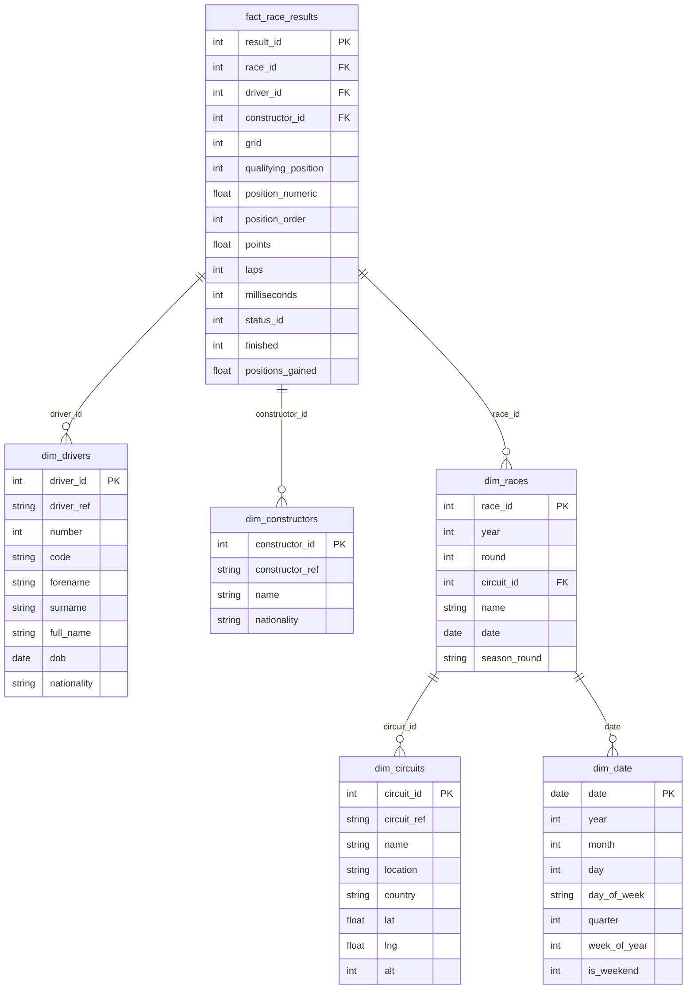

# F1 Data Warehouse — Star Schema

## Entity-Relationship Diagram

## Design Decisions

- **Grain**: One row per driver per race entry (finest grain available).
- **Dimensions**: Five conformed dimensions covering who (drivers, constructors), where (circuits), when (races, date), and what happened (fact measures).
- **Date dimension**: Generated from race dates rather than a full calendar spine, since F1 events are sparse (~20-24 days per year).
- **SCD strategy**: Type 1 (overwrite) for all dimensions. Driver nationality and constructor name changes are rare enough that historical tracking adds complexity without analytical value.
- **Storage**: DuckDB single-file database for zero-configuration OLAP queries.
